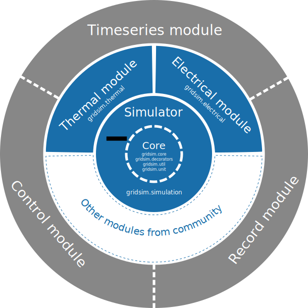

.. _overview-ref:

########
Overview
########

***************
Modular concept
***************

Gridsim is spread over multiple modules in order to minimize dependencies and
maximize the flexibility for the user. Especially each aspect of the simulation
is kept in a separate package and the simulation is driven from the main package
:mod:`gridsim.simulation`.

The following illustration shows the idea behind this concept:

Core Simulator
==============

Simulation
----------

The core module orchestrates the whole simulation process and gives the user
access to the functionality of the simulation modules via a simple API.
The **Simulator** object keeps the time of the simulation and enables the user
to proceed in time either by steps or by running the simulation for a given time
and step size.

Electrical
----------
The Electrical simulation module takes care of the actual electrical simulation
of Energy Consumers and Producers.

Electrical network
^^^^^^^^^^^^^^^^^^
This module takes care of all connections between electrical nodes. The module
currently supports 2 calculation methods:

* **Direct Load Flow Computing:** for fast results.
* **Newton-Rhapsody Flow Computing:** for a detailed simulation.

Thermal
-------
The Thermal simulation module enables simulations of simple thermodynamic
processes and their interaction between each other and by heating or colling
them electrically.

Electrothermal
--------------
Groups electro-thermal elements that do not belong to the electric nor the
thermal module.

Input/Output
============

Control
-------
Provides control strategies like for example a simple thermostat in order to
control an attribute of an object based on the current values of attributes of
that or other objects.

Timeseries
----------
Offers a very simple way to load the content of CSV-based data files into object
attributes. This is not really a simulation module, it is rather a helper
module.

Recorder
--------
This module can be used to record attributes of numerical time either into files
or in order to plot these signals into charts and save them either as images or
PDF files. This is not a simulation module at all, it provides additional
functionality to the system.

New simulation modules
======================
Of course you can add your custom simulation module to the system.

******************
Simulation process
******************

Before doing anything else, you have to create an object of the class
:class:`gridsim.simulation.Simulator`. This will automatically, almost magically
create an instance of each simulation module you have imported into your Python
file.::

    import gridsim.core
    import gridsim.electrical

    sim = Simulator()

The fact that you import the gridsim.electrical module registers this module
within the simulator and every time an instance of the class
:class:`gridsim.simulation.Simulator` is created, an instance of the simulation
module will be created too and registered within the main simulation object.

The next step would be to add elements to the different simulation modules and
actually to create a topology by defining the interactions between the elements.
How this is done hardly depends the simulation module used.

Once the elements and the topology are defined, the simulation can be started
using the main simulation object::

    sim.reset()                         # Resets the simulation. This is optional and will be
                                        # called automatically before doing the first step.
    sim.step(0.1)                       # This will simulate a single step of 0.1 second.
    sim.run(1 * Simulator.HOUR, 0.1)    # This simulates an hour with a resolution of 0.1
                                        # seconds per step.

The following figure shows the typical interaction between the gridsim simulator
object and the simulation modules:

.. figure:: ./figures/model-sequence1.png
    :align: center

* Calling the **reset()** method of the Simulator object will call **reset()**
  on each registered simulation module.
* When a single simulation step has to be executed by calling the **step()**
  method, the **Simulator** object calls first the **calculate()** method on
  every registered simulation module, allowing them to calculate the internal
  states of all their elements. Then the time value is incremented by the step
  size before the **update()** method is called on each registered simulation
  module in order to make the internal states of their elements public.
* The method **run()** calls the step method simply as long as the sum of the
  step sizes done is less than the given run time.

Despite the fact that the simulation module is completely free how to organize
its internal simulation behavior, the normal case is shown in the following
sequence diagram:

.. figure:: ./figures/model-sequence2.png
    :align: center

* If the **reset()** method is called, the module should just call the
  **reset()** method on each simulation element, as the element probably knows
  best how to reset his internal and external state.
* For the **calculate()** method there are basically two scenarios possible:

    * **Delegate the actual calculation to the elements (blue)**:
      In this case, the simulation module just calls the **calculate()** method
      on all his elements and the actual simulation calculations are made inside
      these. This is the simplest, but almost for sure the most inefficient
      method.

    * **The Simulation module calculates the values**:
      This enables the simulation module to use optimized matrix calculations or
      vectorized version of the algorithms in order to accelerate the
      calculation.

* The main simulation object calls the method **update()** on all simulation
  modules in order all simulation elements copy their private state just
  calculated to the public attributes. In the most cases, this can be
  implemented by the simulation elements and the simulation module has just to
  call the **update()** method on all these elements it manages.

********
Packages
********

The following figure shows the structure of the gridsim framework:

.. figure:: ./figures/model-packages.png
    :align: center

.. Note::
    The number of packages will evolve over time as new modules can be written
    to handle a new simulation aspect.

************
UML diagrams
************

gridsim.core
============

**gridsim.core** is the heart of the gridsim simulation framework. The following
figure contains a detailed UML diagram of that module.

.. figure:: ./figures/model-core.png
    :align: center

We refer to the :doc:`documentation` for more details...

gridsim.recorder
================

A simulation with no output is pretty useless, so the **gridsim.recorder**
module enables to save the simulation data either in text based files or enables
to plot the values. The following figure contains a detailed UML diagram of that
module.

.. figure:: ./figures/model-recorder.png
    :align: center

We refer to the :doc:`documentation` for more details...

gridsim.timeseries
==================

The **gridsim.timeseries** module offers convenient methods to load statistical
or real-world data into Python objects as attributes. The following figure
contains a detailed UML diagram of that module.

.. figure:: ./figures/model-timeseries.png
    :align: center

gridsim.electrical
==================

The **gridsim.electrical** module implements the electrical part of the gridsim
simulator. It basically manages Consuming-Producing-Storing (CPS) Elements,
which consume (positive sign) and/or produce (negative sign) a certain amount of
energy ('delta_energy') at each simulation step.

.. figure:: ./figures/model_electrical.png
    :align: center

gridsim.electricalnetwork
=========================

The **gridsim.electricalnetwork** provides a toolbox to the gridsim simulator to
perform computation of electrical values within the electrical network, in other
words to solve the so-called power-flow problem
http://en.wikipedia.org/wiki/Power-flow_study#Power-flow_problem_formulation.

.. figure:: ./figures/model_electricalnetwork.png
    :align: center

gridsim.thermal
===============

Enables the simulation of thermal processes and their interactions. The
following illustration shows a detailed UML diagram:

.. figure:: ./figures/model-thermal.png
    :align: center

We refer to the :doc:`documentation` for more details...

gridsim.electrothermal
======================

Groups electro-thermal elements that do not belong to the electric nor the
thermal module:

.. figure:: ./figures/model-electrothermal.png
    :align: center

We refer to the :doc:`documentation` for more details...

gridsim.control
===============

Enables the simulation of control strategies and devices by writing to Python
attributes depending the actual value of the same or other attribute values.

.. figure:: ./figures/model-controller.png
    :align: center

We refer to the :doc:`documentation` for more details...
