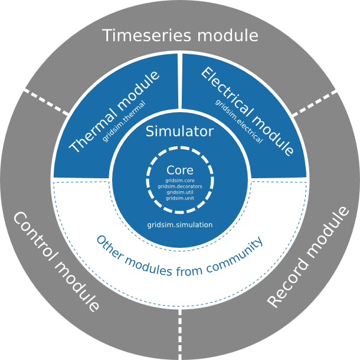
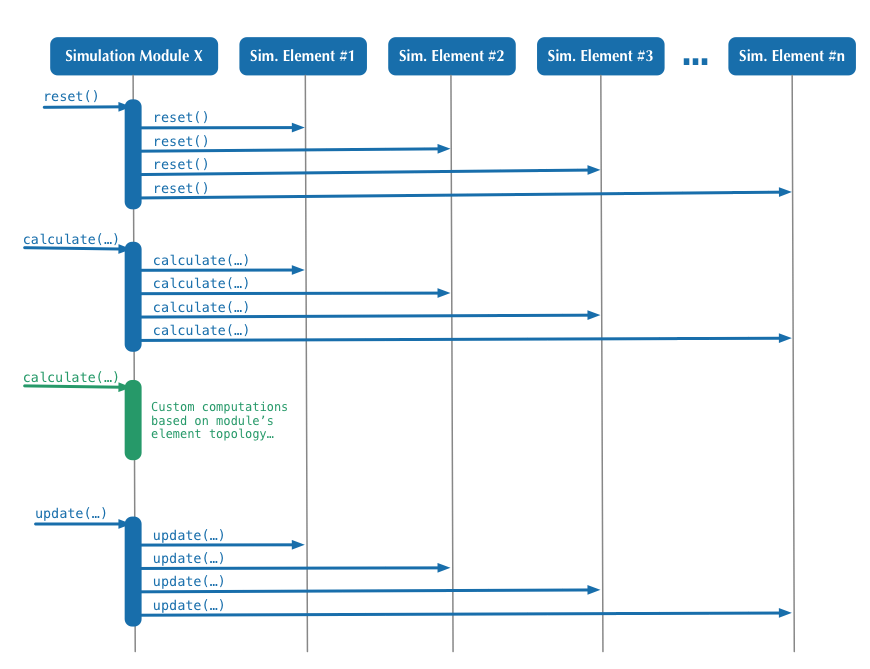
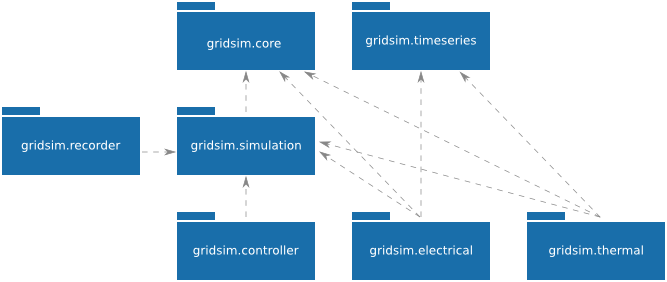
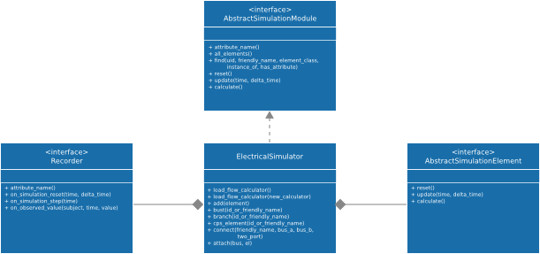
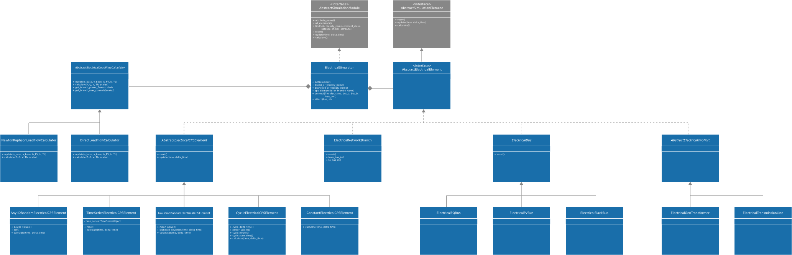
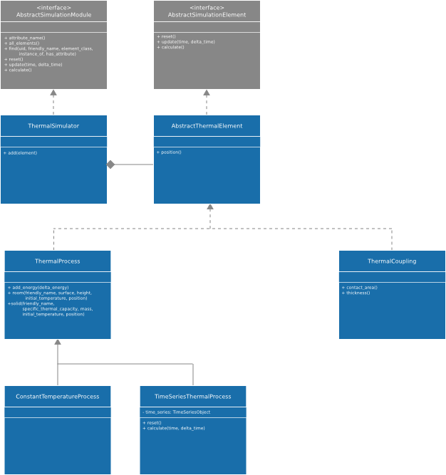

.. _overview-ref:

########
Overview
########

***************
Modular concept
***************

Gridsim is spread over multiple modules in order to minimize dependencies and
maximize the flexibility for the user. Especially each aspect of the simulation
is kept in a separate package and the simulation is driven from the main package
:mod:`gridsim.simulation`.

The following illustration shows the idea behind this concept:

    Gridsim organisation

Simulation
==========

Core
----

The Gridsim core includes several packages which orchestrate the whole
simulation process and offers useful functionality to users (developers or
simple users).

Simulator
---------

The Gridsim simulator gives an access to the functionality of the simulation via
a simple API. The :class:`.Simulator` object keeps the time of
the simulation and enables the user to proceed in time either by steps or by
running the simulation for a given time and step size.

Electrical
----------

The Electrical simulation takes care of the actual electrical simulation
of Energy Consumers and Producers.

This module takes care of all connections between electrical nodes. The module
currently supports 2 calculation methods:

* **Direct Load Flow Computing:** for fast results.
* **Newton-Raphson Load Flow Computing:** for a detailed simulation.

Thermal
-------
The Thermal simulation module enables simulations of simple thermodynamic
processes and their interaction between each other and by heating or colling
them electrically.

New simulation modules
======================
Of course you can add your custom simulation module to the system. If you want
to develop your own module, you should read :ref:`gridsim-core` and
:ref:`gridsim-tools` pages.

User Interface
==============

Control
-------
Provides control strategies in order to control an attribute of an object based
on the current values of attributes of that or other objects.

Time series
-----------
Offers a very simple way to load the content of data from
:mod:`gridsim.iodata.input` into object attributes.

Recorder
--------
This module can be used to record attributes of numerical time either in order
to provide data to by :mod:`gridsim.iodata.output` to save them in a lot of
formats (e.g.: png, pdf, etc.).

******************
Simulation process
******************

This section provides a brief explanation of how to use the simulator, if you
want more information about use the simulator you should read
:ref:`gridsim-use`.

Before doing anything else, you have to create an object of the class
:class:`.Simulator`. This will automatically, almost magically
create an instance of each simulation module you have imported into your Python
file.::

    import gridsim.simulation
    import gridsim.electrical

    sim = simulation.Simulator()

The fact that you import the :mod:`gridsim.electrical` package registers the electrical
simulator within the simulator and every time an instance of the class
:class:`.Simulator` is created, an instance of the electrical
simulation will be created too and registered within the main simulation object.
If you import a class from a module such as
:class:`.ElectricalPVBus`, you do not need to import
the package. It will be automatically done.

The next step would be to add elements to the different simulation packages and
actually to create a topology by defining the interactions between the elements.
How this is done hardly depends the simulation module used.

Once the elements and the topology are defined, the simulation can be started
using the main simulation object::

    sim.reset()                         # Resets the simulation. This is optional and will be
                                        # called automatically before doing the first step.
    sim.step(0.1)                       # This will simulate a single step of 0.1 second.
    sim.run(1 * Simulator.HOUR, 0.1)    # This simulates an hour with a resolution of 0.1
                                        # seconds per step.

The following figure shows the typical interaction between the Gridsim simulator
object and the simulation modules:

.. figure:: ./figures/model-sequence1.png
    :align: center
    :scale: 100 %

    Sequence diagram of the code above

* Calling the :func:`gridsim.simulation.Simulator.reset` method of the Simulator
  object will call :func:`gridsim.core.AbstractSimulationModule.reset`
  on each registered simulation module.
* When a single simulation step has to be executed by calling the
  :func:`gridsim.simulation.Simulator.step`
  method, the :class:`gridsim.simulation.Simulator` object calls first the
  :func:`gridsim.core.AbstractSimulationModule.calculate` method on
  every registered simulation module, allowing them to calculate the internal
  states of all their elements. Then the time value is incremented by the step
  size before the :func:`gridsim.core.AbstractSimulationModule.calculate` method
  is called on each registered simulation module in order to make the internal
  states of their elements public.
* The method :func:`gridsim.simulation.Simulator.run` calls the step method
  simply as long as the sum of the step sizes done is less than the given run
  time.

Despite the fact that the simulation module is completely free how to organize
its internal simulation behavior, the normal case is shown in the following
sequence diagram:

.. _fig-model-sequence2:

    Sequence diagram of a simulation single step

* If the :func:`gridsim.core.AbstractSimulationModule.reset` method is called,
  the module should just call the
  :func:`gridsim.core.AbstractSimulationElement.reset` method on each simulation
  element, as the element probably knows best how to reset his internal and
  external state.
* For the :func:`gridsim.core.AbstractSimulationModule.calculate` method there
  are basically two scenarios possible:

    * **Delegate the actual calculation to the elements**
      (blue in :ref:`fig-model-sequence2`):
      In this case, the simulation module just calls the
      :func:`gridsim.core.AbstractSimulationElement.calculate` method
      on all his elements and the actual simulation calculations are made inside
      these. This is the simplest, but almost for sure the most inefficient
      method.

    * **The Simulation module calculates the values**
      (green in :ref:`fig-model-sequence2`):
      This enables the simulation module to use optimized matrix calculations or
      vectorized version of the algorithms in order to accelerate the
      calculation.

* The main simulation object calls the method
  :func:`gridsim.core.AbstractSimulationModule.update` on all simulation
  modules in order all simulation elements copy their private state just
  calculated to the public attributes. In the most cases, this can be
  implemented by the simulation elements and the simulation module has just to
  call the :func:`gridsim.core.AbstractSimulationElement.update` method on all
  these elements it manages.

********
Packages
********

The following figure shows the structure of the gridsim framework:

    Package diagram of Gridsim

.. note::
    This diagram presents the main packages of Gridsim and the link between
    them.

    The number of packages as well as their link will evolve over time as
    new modules and features can be written to handle a new simulation aspect.

************
UML diagrams
************

Simulation
==========

This diagram presents the heart of the Gridsim simulation framework.

The :class:`.Simulator` is the main class of Gridsim. It is
composed of modules (such as
:class:`.ElectricalSimulator`) themselves composed of
elements (such as :class:`.ConstantElectricalCPSElement`).
These elements are the living part of the simulation, they will evolve during
the time and interact with others to simulate the exchange of energy.

A simulation with no output is pretty useless, so the
:class:`.Recorder` module enables to save the simulation data
either in text based files or enables to plot the values. The following figure
contains a detailed UML diagram of that module.

We refer to the :ref:`gridsim-use` for more details...

    Class diagram: The heart of Gridsim

.. note::
    The packages are not displayed in this diagram.

gridsim.electrical
==================

The :mod:`gridsim.electrical` module implements the electrical part of the
gridsim simulator. It basically manages Consuming-Producing-Storing (CPS)
Elements, which consume (positive sign) and/or produce (negative sign) a certain
amount of energy ('delta_energy') at each simulation step.

gridsim.thermal
===============

Enables the simulation of thermal processes and their interactions. The
following illustration shows a detailed UML diagram:

We refer to the :ref:`gridsim-use` for more details...

gridsim.control
===============

Enables the simulation of control strategies and devices by writing to Python
attributes depending the actual value of the same or other attribute values.

We refer to the :ref:`gridsim-use` for more details...
